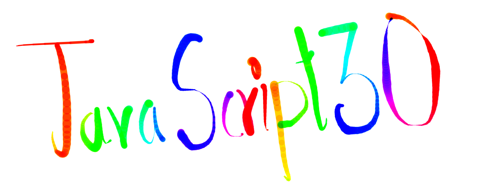

    
    <h1>JavaScript30</h1>

# About

A 30 Days Javascript Challenge following [#Javascript30](https://javascript30.com) by [@wesbos](https://github.com/wesbos).

- Pure JS
- No Frameworks
- No Compilers
- No Boilerplate
- No Libraries.

# 30 Days of Code

Note: [Original Commits from Jan 16, 2020 to Feb 14, 2020.](https://github.com/Karna98/JavaScript30/commits/master?since=2020-01-16&until=2020-02-14)

## Day-1 [🔗](https://karna98.github.io/JavaScript30/Day-1.html)  
Title : **Instrumental**  
Description : Detecting key pressed and performing related action assigned to it.  
Files: [HTML](Day/1.html)  [JS](assets/js/1.js)  
References :
- [querySelector()](https://developer.mozilla.org/en-US/docs/Web/API/Document/querySelector)
- [classList](https://developer.mozilla.org/en-US/docs/Web/API/Element/classList)
- [if..else](https://developer.mozilla.org/en-US/docs/Web/JavaScript/Reference/Statements/if...else)
- [keydown()](https://developer.mozilla.org/en-US/docs/Web/API/Document/keydown_event)
- [setTimeout()](https://developer.mozilla.org/en-US/docs/Web/API/WindowOrWorkerGlobalScope/setTimeout)
- [addEventListener()](https://developer.mozilla.org/en-US/docs/Web/API/EventTarget/addEventListener)

## Day-2 [🔗](https://karna98.github.io/JavaScript30/Day-2.html)  
Title : **Clock**  
Description : Update CSS elements using JS to rotate clock hands.  
Files: [HTML](Day/2.html)  [JS](assets/js/2.js)  
References :
- [Date()](https://developer.mozilla.org/en-US/docs/Web/JavaScript/Reference/Global_Objects/Date)
- [Style transform Property](https://www.w3schools.com/jsref/prop_style_transform.asp)
- [setInterval()](https://developer.mozilla.org/en-US/docs/Web/API/WindowOrWorkerGlobalScope/setInterval)

## Day-3 [🔗](https://karna98.github.io/JavaScript30/Day-3.html)  
Title : **Playing with CSS**  
Description : Changing image properties by playing with different params.  
Files: [HTML](Day/3.html)  [JS](assets/js/3.js)  
References :
- [querySelectorAll()](https://developer.mozilla.org/en-US/docs/Web/API/Document/querySelectorAll)
- [forEach()](https://developer.mozilla.org/en-US/docs/Web/JavaScript/Reference/Global_Objects/Array/forEach)
- [setProperty()](https://developer.mozilla.org/en-US/docs/Web/API/CSSStyleDeclaration/setProperty)
- [DOMContentLoaded](https://developer.mozilla.org/en-US/docs/Web/API/Window/DOMContentLoaded_event)

## Day-4 [🔗](https://karna98.github.io/JavaScript30/Day-4.html)  
Title : **Array Cardio - I**  
Description : Playing with arrays in JS.  
Files: [HTML](Day/4.html)  [JS](assets/js/4.js)  
References :
- [console](https://developer.mozilla.org/en-US/docs/Web/API/console)
- [const](https://developer.mozilla.org/en-US/docs/Web/JavaScript/Reference/Statements/const)
- [arrays in JS](https://developer.mozilla.org/en-US/docs/Web/JavaScript/Reference/Global_Objects/Array)
- [filter()](https://developer.mozilla.org/en-US/docs/Web/JavaScript/Reference/Global_Objects/Array/filter)
- [map()](https://developer.mozilla.org/en-US/docs/Web/JavaScript/Reference/Global_Objects/Array/map)
- [reduce()](https://developer.mozilla.org/en-US/docs/Web/JavaScript/Reference/Global_Objects/Array/reduce)
- [sort()](https://developer.mozilla.org/en-US/docs/Web/JavaScript/Reference/Global_Objects/Array/sort)
- [split()](https://developer.mozilla.org/en-US/docs/Web/JavaScript/Reference/Global_Objects/String/split)

## Day-5 [🔗](https://karna98.github.io/JavaScript30/Day-5.html)  
Title : **Flex Gallery**  
Description : Update CSS flex behaviour with JS.  
Files: [HTML](Day/5.html)  [JS](assets/js/5.js)  
References :
- [length](https://developer.mozilla.org/en-US/docs/Web/JavaScript/Reference/Global_Objects/Array/length)
- [classList](https://developer.mozilla.org/en-US/docs/Web/API/Element/classList)
- [events](https://developer.mozilla.org/en-US/docs/Learn/JavaScript/Building_blocks/Events)

## Day-6 [🔗](https://karna98.github.io/JavaScript30/Day-6.html)  
Title : **Search it with JS**  
Description : Dynamica Search results  
Files: [HTML](Day/6.html)  [JS](assets/js/6.js)  
References :
- [fetch()](https://developer.mozilla.org/en-US/docs/Web/API/Fetch_API/Using_Fetch)
- [then()](https://developer.mozilla.org/en-US/docs/Web/JavaScript/Reference/Global_Objects/Promise/then)
- [json()](https://developer.mozilla.org/en-US/docs/Web/API/Body/json)
- [Object.entries()](https://developer.mozilla.org/en-US/docs/Web/JavaScript/Reference/Global_Objects/Object/entries)
- [RegExp()](https://developer.mozilla.org/en-US/docs/Web/JavaScript/Reference/Global_Objects/RegExp)
- [match()](https://developer.mozilla.org/en-US/docs/Web/JavaScript/Reference/Global_Objects/String/match)
- [push()](https://developer.mozilla.org/en-US/docs/Web/JavaScript/Reference/Global_Objects/Array/push)
- [replace()](https://developer.mozilla.org/en-US/docs/Web/JavaScript/Reference/Global_Objects/String/replace)
- [join()](https://developer.mozilla.org/en-US/docs/Web/JavaScript/Reference/Global_Objects/Array/join)
- [innerHTML](https://developer.mozilla.org/en-US/docs/Web/API/Element/innerHTML)
- [change](https://developer.mozilla.org/en-US/docs/Web/API/HTMLElement/change_event)
- [keyup](https://developer.mozilla.org/en-US/docs/Web/API/Document/keyup_event)

## Day-7 [🔗](https://karna98.github.io/JavaScript30/Day-7.html)  
Title : **Array Cardio - II**  
Description : Playing with arrays in JS.  
Files: [HTML](Day/7.html)  [JS](assets/js/7.js)  
References :
- [console.log()](https://developer.mozilla.org/en-US/docs/Web/API/Console/log)
- [console.table()](https://developer.mozilla.org/en-US/docs/Web/API/Console/table)
- [some()](https://developer.mozilla.org/en-US/docs/Web/JavaScript/Reference/Global_Objects/Array/some)
- [every()](https://developer.mozilla.org/en-US/docs/Web/JavaScript/Reference/Global_Objects/Array/every)
- [find()](https://developer.mozilla.org/en-US/docs/Web/JavaScript/Reference/Global_Objects/Array/find)
- [findIndex()](https://developer.mozilla.org/en-US/docs/Web/JavaScript/Reference/Global_Objects/Array/findIndex)
- [slice()](https://developer.mozilla.org/en-US/docs/Web/JavaScript/Reference/Global_Objects/Array/slice)
- [splice()](https://developer.mozilla.org/en-US/docs/Web/JavaScript/Reference/Global_Objects/Array/splice)

## Day-8 [🔗](https://karna98.github.io/JavaScript30/Day-8.html)  
Title : **Draw on Canvas**  
Description : Canvas to draw the masterpiece.  
Files: [HTML](Day/8.html)  [JS](assets/js/8.js)  
References :
- [canvas](https://developer.mozilla.org/en-US/docs/Web/API/Canvas_API)
- [getContext()](https://developer.mozilla.org/en-US/docs/Web/API/HTMLCanvasElement/getContext)
- [beginPath()](https://developer.mozilla.org/en-US/docs/Web/API/CanvasRenderingContext2D/beginPath)
- [moveTo()](https://developer.mozilla.org/en-US/docs/Web/API/CanvasRenderingContext2D/moveTo)
- [lineTo()](https://developer.mozilla.org/en-US/docs/Web/API/CanvasRenderingContext2D/lineTo)
- [stroke()](https://developer.mozilla.org/en-US/docs/Web/API/CanvasRenderingContext2D/stroke)

## Day-9 [🔗](https://karna98.github.io/JavaScript30/Day-9.html)  
Title : **Console Tricks!**  
Description : Playing with Javascript inbuilt functions.  
Files: [HTML](Day/9.html)  [JS](assets/js/9.js)  
References :
- [console.clear()](https://developer.mozilla.org/en-US/docs/Web/API/Console/clear)
- [console.log()](https://developer.mozilla.org/en-US/docs/Web/API/Console/log)
- [console.warn()](https://developer.mozilla.org/en-US/docs/Web/API/Console/warn)
- [console.error()](https://developer.mozilla.org/en-US/docs/Web/API/Console/error)
- [console.info()](https://developer.mozilla.org/en-US/docs/Web/API/Console/info)
- [console.assert()](https://developer.mozilla.org/en-US/docs/Web/API/Console/assert)
- [console.dir()](https://developer.mozilla.org/en-US/docs/Web/API/Console/dir)
- [console.groupCollapsed()](https://developer.mozilla.org/en-US/docs/Web/API/Console/groupCollapsed)
- [console.groupEnd()](https://developer.mozilla.org/en-US/docs/Web/API/Console/groupEnd)
- [console.count()](https://developer.mozilla.org/en-US/docs/Web/API/Console/count)
- [console.time()](https://developer.mozilla.org/en-US/docs/Web/API/Console/time)
- [console.timeEnd()](https://developer.mozilla.org/en-US/docs/Web/API/Console/timeEnd)

## Day-10 [🔗](https://karna98.github.io/JavaScript30/Day-10.html)  
Title : **Shift to Check Multiple Checkboxes**  
Description : Handling pressed key and mouse event.  
Files: [HTML](Day/10.html)  [JS](assets/js/10.js)  
References :
- [KeyboardEvent.shiftKey](https://developer.mozilla.org/en-US/docs/Web/API/KeyboardEvent/shiftKey)
- [checked](https://www.w3schools.com/jsref/prop_checkbox_checked.asp)

## Day-11 [🔗](https://karna98.github.io/JavaScript30/Day-11.html)  
Title : **Custom Video Player**  
Description : Redefining Video Controls handled using JS.  
Files: [HTML](Day/11.html)  [JS](assets/js/11.js)  
References :
- [click](https://developer.mozilla.org/en-US/docs/Web/API/Element/click_event)
- [play](https://developer.mozilla.org/en-US/docs/Web/API/HTMLMediaElement/play_event)
- [pause](https://developer.mozilla.org/en-US/docs/Web/API/HTMLMediaElement/pause_event)
- [timeupdate](https://developer.mozilla.org/en-US/docs/Web/API/HTMLMediaElement/timeupdate_event)
- [mousemove](https://developer.mozilla.org/en-US/docs/Web/API/Element/mousemove_event)
- [mousedown](https://developer.mozilla.org/en-US/docs/Web/API/Element/mousedown_event)
- [mouseup](https://developer.mozilla.org/en-US/docs/Web/API/Element/mouseup_event)

## Day-12 [🔗](https://karna98.github.io/JavaScript30/Day-12.html)  
Title : **Konami Code**  
Description : Detecting user input words and the magic happens.  
Files: [HTML](Day/12.html)  [JS](assets/js/12.js)  
References :
- [cornify](https://www.cornify.com/)
- [includes](https://developer.mozilla.org/en-US/docs/Web/JavaScript/Reference/Global_Objects/String/includes)
- [try..catch](https://developer.mozilla.org/en-US/docs/Web/JavaScript/Reference/Statements/try...catch)

## Day-13 [🔗](https://karna98.github.io/JavaScript30/Day-13.html)  
Title : **Slide in on Scroll**  
Description : Image effect based on Scroll.  
Files: [HTML](Day/13.html)  [JS](assets/js/13.js)  
References :
- [window](https://developer.mozilla.org/en-US/docs/Web/API/Window)
- [scroll](https://developer.mozilla.org/en-US/docs/Web/API/Window/scroll)
- [scrollY](https://developer.mozilla.org/en-US/docs/Web/API/Window/scrollY)
- [innerHeight](https://developer.mozilla.org/en-US/docs/Web/API/Window/innerHeight)

## Day-14 [🔗](https://karna98.github.io/JavaScript30/Day-14.html)  
Title : **References VS Copying**  
Description : Playing with JS datatypes.  
Files: [HTML](Day/14.html)  [JS](assets/js/14.js)  
References :
- [let](https://developer.mozilla.org/en-US/docs/Web/JavaScript/Reference/Statements/let)
- [concat](https://developer.mozilla.org/en-US/docs/Web/JavaScript/Reference/Global_Objects/Array/concat)
- [Spread (...)](https://developer.mozilla.org/en-US/docs/Web/JavaScript/Reference/Operators/Spread_syntax)
- [Object](https://developer.mozilla.org/en-US/docs/Web/JavaScript/Reference/Global_Objects/Object)
- [Object.assign()](https://developer.mozilla.org/en-US/docs/Web/JavaScript/Reference/Global_Objects/Object/assign)
- [JSON](https://developer.mozilla.org/en-US/docs/Web/JavaScript/Reference/Global_Objects/JSON)
- [JSON.parse()](https://developer.mozilla.org/en-US/docs/Web/JavaScript/Reference/Global_Objects/JSON/parse)
- [JSON.stringify](https://developer.mozilla.org/en-US/docs/Web/JavaScript/Reference/Global_Objects/JSON/stringify)

## Day-15 [🔗](https://karna98.github.io/JavaScript30/Day-15.html)  
Title : **LocalStorage**  
Description : Playing with local storage.  
Files: [HTML](Day/15.html)  [JS](assets/js/15.js)  
References :
- [submit](https://developer.mozilla.org/en-US/docs/Web/API/HTMLFormElement/submit_event)
- [localStorage](https://developer.mozilla.org/en-US/docs/Web/API/Window/localStorage)
- [getItem()](https://developer.mozilla.org/en-US/docs/Web/API/Storage/getItem)
- [setItem()](https://developer.mozilla.org/en-US/docs/Web/API/Storage/setItem)
- [reset()](https://developer.mozilla.org/en-US/docs/Web/API/HTMLFormElement/reset)
- [matches()](https://developer.mozilla.org/en-US/docs/Web/API/Element/matches)
- [return](https://developer.mozilla.org/en-US/docs/Web/JavaScript/Reference/Statements/return)

## Day-16 [🔗](https://karna98.github.io/JavaScript30/Day-16.html)  
Title : **Mouse Shadow**  
Description : Effect based on mouse position.  
Files: [HTML](Day/16.html)  [JS](assets/js/16.js)  
References :
- [offsetLeft](https://developer.mozilla.org/en-US/docs/Web/API/HTMLElement/offsetLeft)
- [offsetTop](https://developer.mozilla.org/en-US/docs/Web/API/HTMLElement/offsetTop)
- [Math](https://developer.mozilla.org/en-US/docs/Web/JavaScript/Reference/Global_Objects/Math)
- [round()](https://developer.mozilla.org/en-US/docs/Web/JavaScript/Reference/Global_Objects/Math/round)

## Day-17 [🔗](https://karna98.github.io/JavaScript30/Day-17.html)  
Title : **Sort Without Articles**  
Description : Sorting list.  
Files: [HTML](Day/17.html)  [JS](assets/js/17.js)  
References :
- [getElementsByClassName()](https://developer.mozilla.org/en-US/docs/Web/API/Document/getElementsByClassName)
- [trim()](https://developer.mozilla.org/en-US/docs/Web/JavaScript/Reference/Global_Objects/String/Trim)

## Day-18 [🔗](https://karna98.github.io/JavaScript30/Day-18.html)  
Title : **Adding Up Times with Reduce**  
Description : Simple time addition using map-reduce.  
Files: [HTML](Day/18.html)  [JS](assets/js/18.js)  
References :
- [var](https://developer.mozilla.org/en-US/docs/Web/JavaScript/Reference/Statements/var)
- [Conditional (ternary) operator '?'](https://developer.mozilla.org/en-US/docs/Web/JavaScript/Reference/Operators/Conditional_Operator)
- [floor()](https://developer.mozilla.org/en-US/docs/Web/JavaScript/Reference/Global_Objects/Math/floor)
- [parentNode](https://developer.mozilla.org/en-US/docs/Web/API/Node/parentNode)

## Day-19 [🔗](https://karna98.github.io/JavaScript30/Day-19.html)  
Title : **Webcam Fun**  
Description : Lets play with camera and colour.  
Files: [HTML](Day/19.html)  [JS](assets/js/19.js)  
References :
- [navigator](https://developer.mozilla.org/en-US/docs/Web/API/Navigator)
- [mediaDevices](https://developer.mozilla.org/en-US/docs/Web/API/MediaDevices)
- [getUserMedia()](https://developer.mozilla.org/en-US/docs/Web/API/MediaDevices/getUserMedia)
- [drawImage()](https://developer.mozilla.org/en-US/docs/Web/API/CanvasRenderingContext2D/drawImage)
- [putImageData()](https://developer.mozilla.org/en-US/docs/Web/API/CanvasRenderingContext2D/putImageData)
- [toDataURL()](https://developer.mozilla.org/en-US/docs/Web/API/HTMLCanvasElement/toDataURL)
- [setAttribute()](https://developer.mozilla.org/en-US/docs/Web/API/Element/setAttribute)
- [insertBefore()](https://developer.mozilla.org/en-US/docs/Web/API/Node/insertBefore)
- [canplay](https://developer.mozilla.org/en-US/docs/Web/API/HTMLMediaElement/canplay_event)

## Day-20 [🔗](https://karna98.github.io/JavaScript30/Day-20.html)  
Title : **Speech Detection**  
Description : Speech to Text.  
Files: [HTML](Day/20.html)  [JS](assets/js/20.js)  
References :
- [SpeechRecognition](https://developer.mozilla.org/en-US/docs/Web/API/SpeechRecognition)
- [webkitSpeechRecognition](https://developers.google.com/web/updates/2013/01/Voice-Driven-Web-Apps-Introduction-to-the-Web-Speech-API)
- [recognition.start()](https://developer.mozilla.org/en-US/docs/Web/API/SpeechRecognition/start)
- [recognition.interimResults](https://developer.mozilla.org/en-US/docs/Web/API/SpeechRecognition/interimResults)
- [createElement()](https://developer.mozilla.org/en-US/docs/Web/API/Document/createElement)
- [appendChild()](https://developer.mozilla.org/en-US/docs/Web/API/Node/appendChild)
- [end](https://developer.mozilla.org/en-US/docs/Web/API/SpeechRecognition/end_event)

## Day-21 [🔗](https://karna98.github.io/JavaScript30/Day-21.html)  
Title : **Geolocation**  
Description : Getting current location and speed.  
Files: [HTML](Day/21.html)  [JS](assets/js/21.js)  
References :
- [navigator.geolocation](https://developer.mozilla.org/en-US/docs/Web/API/Navigator/geolocation)
- [watchPosition()](https://developer.mozilla.org/en-US/docs/Web/API/Geolocation/watchPosition)
- [speed](https://developer.mozilla.org/en-US/docs/Web/API/GeolocationCoordinates/speed)
- [heading](https://developer.mozilla.org/en-US/docs/Web/API/GeolocationCoordinates/heading)
- [latitude](https://developer.mozilla.org/en-US/docs/Web/API/GeolocationCoordinates/latitude)
- [longitude](https://developer.mozilla.org/en-US/docs/Web/API/GeolocationCoordinates/longitude)

## Day-22 [🔗](https://karna98.github.io/JavaScript30/Day-22.html)  
Title : **Follow Along Nav**  
Description : Tracking mouse.  
Files: [HTML](Day/22.html)  [JS](assets/js/22.js)  
References :
- [mouseenter](https://developer.mozilla.org/en-US/docs/Web/API/Element/mouseenter_event)
- [scrollX](https://developer.mozilla.org/en-US/docs/Web/API/Window/scrollX)
- [getBoundingClientRect()](https://developer.mozilla.org/en-US/docs/Web/API/Element/getBoundingClientRect)

## Day-23 [🔗](https://karna98.github.io/JavaScript30/Day-23.html)  
Title : **Speech Synthesis**  
Description : Text to Speech.  
Files: [HTML](Day/23.html)  [JS](assets/js/23.js)  
References :
- [SpeechSynthesisUtterance()](https://developer.mozilla.org/en-US/docs/Web/API/SpeechSynthesisUtterance)
- [speak()](https://developer.mozilla.org/en-US/docs/Web/API/SpeechSynthesis/speak)

## Day-24 [🔗](https://karna98.github.io/JavaScript30/Day-24.html)  
Title : **Sticky Nav**  
Description : Fancy navbar.  
Files: [HTML](Day/24.html)  [JS](assets/js/24.js)  
References :
- [classList.add()](https://developer.mozilla.org/en-US/docs/Web/API/DOMTokenList/add)
- [classList.remove()](https://developer.mozilla.org/en-US/docs/Web/API/DOMTokenList/remove)

## Day-25 [🔗](https://karna98.github.io/JavaScript30/Day-25.html)  
Title : **Understanding JavaScript's Capture**  
Description : Understand the displayed layout.  
Files: [HTML](Day/25.html)  [JS](assets/js/25.js)  
References :
- [addEventListener - capture](https://developer.mozilla.org/en-US/docs/Web/API/EventTarget/addEventListener)
- [addEventListener - once](https://developer.mozilla.org/en-US/docs/Web/API/EventTarget/addEventListener)
- [stopPropagation()](https://developer.mozilla.org/en-US/docs/Web/API/Event/stopPropagation)

## Day-26 [🔗](https://karna98.github.io/JavaScript30/Day-26.html)  
Title : **Follow Along Nav**  
Description : Fancy navbar menu.  
Files: [HTML](Day/26.html)  [JS](assets/js/26.js)  
References :
- [mouseleave](https://developer.mozilla.org/en-US/docs/Web/API/Element/mouseleave_event)

## Day-27 [🔗](https://karna98.github.io/JavaScript30/Day-27.html)  
Title : **Click and Drag**  
Description : Visualiser.  
Files: [HTML](Day/27.html)  [JS](assets/js/27.js)  
References :
- [pageX](https://developer.mozilla.org/en-US/docs/Web/API/MouseEvent/pageX)

## Day-28 [🔗](https://karna98.github.io/JavaScript30/Day-28.html)  
Title : **Video Speed Scrubber**  
Description : Playing with playback Speed.  
Files: [HTML](Day/28.html)  [JS](assets/js/28.js)  
References :
- [pageY](https://developer.mozilla.org/en-US/docs/Web/API/MouseEvent/pageY)
- [offsetTop](https://developer.mozilla.org/en-US/docs/Web/API/HTMLElement/offsetTop)
- [offsetHeight](https://developer.mozilla.org/en-US/docs/Web/API/HTMLElement/offsetHeight)
- [toFixed()](https://developer.mozilla.org/en-US/docs/Web/JavaScript/Reference/Global_Objects/Number/toFixed)

## Day-29 [🔗](https://karna98.github.io/JavaScript30/Day-29.html)  
Title : **Countdown Timer**  
Description : Utility Tool to take a break from work.  
Files: [HTML](Day/29.html)  [JS](assets/js/29.js)  
References :
- [clearInterval()](https://developer.mozilla.org/en-US/docs/Web/API/WindowOrWorkerGlobalScope/clearInterval)
- [Date.now()](https://developer.mozilla.org/en-US/docs/Web/JavaScript/Reference/Global_Objects/Date/now)
- [getHours()](https://developer.mozilla.org/en-US/docs/Web/JavaScript/Reference/Global_Objects/Date/getHours)
- [getMinutes()](https://developer.mozilla.org/en-US/docs/Web/JavaScript/Reference/Global_Objects/Date/getMinutes)
- [preventDefault()](https://developer.mozilla.org/en-US/docs/Web/API/Event/preventDefault)

## Day-30 [🔗](https://karna98.github.io/JavaScript30/Day-30.html)  
Title : **Whack A Mole!**  
Description : Samll Fun Game.  
Files: [HTML](Day/30.html)  [JS](assets/js/30.js)  
References :
- [random()](https://developer.mozilla.org/en-US/docs/Web/JavaScript/Reference/Global_Objects/Math/random)
- [event.isTrusted](https://developer.mozilla.org/en-US/docs/Web/API/Event/isTrusted)
